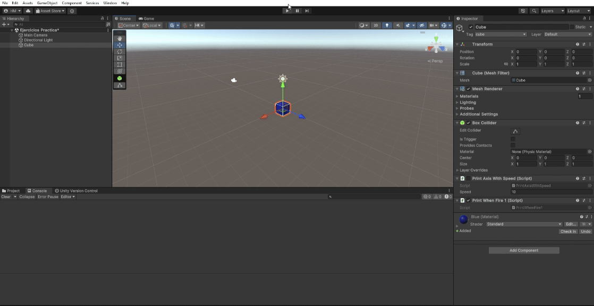
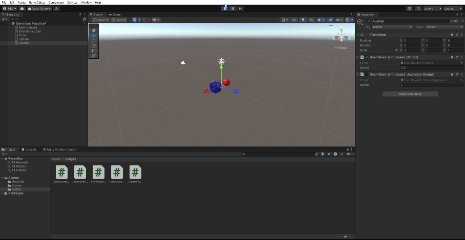
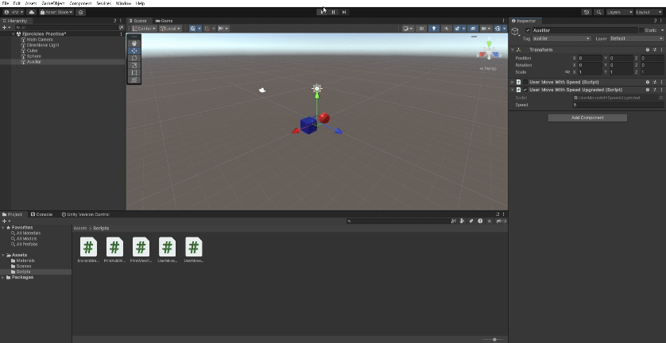

# Interfaces Inteligentes

- Hugo Hernández Martín (alu0101481227@ull.edu.es)

# Práctica 3: Introducción a las Físicas de Unity

## Experimentando con las físicas del editor

### Situación 1:

* El plano no es un objeto físico perfecto, sólo tiene collider.
* El cubo es un objeto físico perfecto (con collider y Rigidbody).
* La esfera no es un objeto físico perfecto, sólo tiene collider.

No sucede nada, ya que el cubo es el único que se ve afectado por las físicas y está sobre el plano (que tiene un collider que impide que caiga por la gravedad). Como la esfera tiene collider pero no está en la simulación de físicas, no cae.

### Situación 2:

* El plano no es un objeto físico perfecto, sólo tiene collider.
* El cubo es un objeto físico perfecto (con collider y Rigidbody).
* La esfera es un objeto físico perfecto (con collider y Rigidbody).

La esfera es añadida a la simulación de físicas, por lo tanto se ve afectada por la gravedad, colisiona con el cubo (ya que este posee collider) y, al salirse del plano cae al vacío. Además, el cubo no se desplaza por el choque.

### Situación 3:

* El plano no es un objeto físico perfecto, sólo tiene collider.
* El cubo es un objeto físico perfecto (con collider y Rigidbody).
* La esfera es un objeto físico cinemático (con collider y Rigidbody).

Al convertir la esfera a cinemática, el motor de físicas no se encargará de su movimiento, por lo que la gravedad dejará de afectarle. Nos encontraremos en una situación similar a la presentada en la situación 1 aunque posea un Rigidbody.

### Situación 4:

* El plano es un objeto físico perfecto (con collider y Rigidbody).
* El cubo es un objeto físico perfecto (con collider y Rigidbody).
* La esfera es un objeto físico perfecto (con collider y Rigidbody).

Al ser todos los objetos físicos perfectos, todos son están incluidos en el motor de físicas y son afectados por la gravedad, es por ello que todos caen al vacío a la vez.

### Situación 5:

* El plano es un objeto físico perfecto (con collider y Rigidbody).
* El cubo es un objeto físico perfecto (con collider y Rigidbody).
* La esfera es un objeto físico perfecto (con collider y Rigidbody). Además, tiene una masa 10 veces mayor que el cubo.

En este caso sucede lo mismo que en la situación anterior, ya que la aceleración de la gravedad es la misma para todos los cuerpos a la misma distancia, independientemente de su masa (en ausencia de rozamiento).

### Situación 6:

* El plano es un objeto físico perfecto (con collider y Rigidbody).
* El cubo es un objeto físico perfecto (con collider y Rigidbody).
* La esfera es un objeto físico perfecto (con collider y Rigidbody). Además, tiene una masa 100 veces mayor que el cubo.

Se puede observar que sucede lo mismo que en la situación anterior, a causa de lo mismo.

### Situación 7

* El plano es un objeto físico perfecto (con collider y Rigidbody).
* El cubo es un objeto físico perfecto (con collider y Rigidbody).
* La esfera es un objeto físico perfecto (con collider y Rigidbody). Además, tiene una fuerza de fricción (en este caso de 5).

Se puede observar como tanto el plano como el cubo caen a la misma velocidad por la gravedad (sin rozamiento). En cambio, como la esfera está siendo afectada por el rozamiento cae más lentamente (por el parametro introducido, que puede variar para cambiar la velocidad a la que cae).

### Situación 8

* El plano es un objeto físico perfecto (con collider y Rigidbody).
* El cubo es un objeto físico perfecto (con collider y Rigidbody).
* La esfera es un objeto físico cinemático (con collider y Rigidbody). Además, tiene la opción *isTrigger* activada.

El plano y el cubo son físicos perfectos, por lo que caen por la gravedad. Por otra parte, la esfera se queda en la misma posición porque es cinemática, el motor de físicas no la mueve. Que la esfera sea Trigger hace que no colisione con otros colliders, aunque no se da la circustancia en el ejemplo.

### Situación 9

* El plano es un objeto físico perfecto (con collider y Rigidbody).
* El cubo es un objeto físico perfecto (con collider y Rigidbody).
* La esfera es un objeto físico perfecto (con collider y Rigidbody). Además, tiene la opción *isTrigger* activada.

Los tres objetos son movidos por el motor de físicas, en mi caso, le he puesto un drag (rozamiento) de 5 al plano y al cubo para visualizar mejor el resultado de que la esfera sea Trigger. Como se puede observar, no interactúa con los colliders ni del plano ni del cubo y los atraviesa.

## Movimientos - Físicas

### Actividad 1

Se añade un cubo a la escena y se le pone un atributo público *Speed* que permite modificar la velocidad desde el Inspector. Cada vez que se pulsa una de las flechas se muestra el valor del eje asociado (*Horizontal* si son las flechas hacia arriba o abajo y *Vertical* en las flechas hacia los lados) multiplicado por la velocidad.

>[!IMPORTANT]
> [Enlace a Script.](scripts/PrintAxisWithSpeed.cs)

### Actividad 2

Se ha mapeado la tecla "H" para el disparo (En Assets/Project Settings/Fire1/Positive Button). Además, se ha hecho un pequeño Script que imprime por consola el valor del Fire 1 para comprobar el funcionamiento (al pulsar la tecla indicada dispara y, si no, no).

>[!IMPORTANT]
> [Enlace a Script.](scripts/PrintWhenFire1.cs)

### Actividad 3

Se ha añadido un script al cubo con dos atributos públicos (para permitir modificar sus valores en el inspector) *moveDirection* (Vector3 que indica la dirección en la que se moverá el cubo) y *speed* (indica la velocidad del movimiento). En el script se usa el método ***Translate*** de la propiedad ***transform*** del objeto que lo posee como componente. Además de tener en cuenta la dirección introducida y la velocidad dada, hay que usar ***Time.deltaTime*** para lograr un movimiento fluido. A continuación se muestra un ejemplo de ejecución:

>[!IMPORTANT]
> [Enlace a Script.](scripts/MoveInDirectionWithSpeed.cs)

Explicación a las situaciones presentadas en el guión:

#### a) Duplicar coordenadas del vector de movimiento

Al duplicar las coordenadas del vector de movimiento se aumenta la velocidad del movimiento, ya que no se está normalizando el mismo antes de introducirlo al translate. Si se quisiera que esto no sucediera, la solución es la presentada, normalizar el vector de movimiento para que su modulo sea unitario.

#### b) Duplicar velocidad manteniendo el movimiento

Si duplicas la velocidad manteniendo el movimiento también se aumenta la velocidad, en este caso es el comportamiento esperado y deseado.

#### c) Velocidad < 1

Si la velocidad sigue siendo positiva, el cubo se moverá en la dirección especificada pero con mayor lentitud. Si la velocidad es 0, el cubo se quedará parado. Por último, si la velocidad es negativa, el cubo se moverá en la dirección indicada por el vector pero en el sentido contrario al que éste establece.

#### d) Posición del cubo con y > 1

Cambiar la posición del cubo no afecta al movimiento, ya que se está usando el sistema de referencia local.

#### e) Intercambiar movimiento relativo al sistema de referencia (entre Local y Global)

Intercambiar los movimientos para que sean relativos a diferentes sistemas de referencia en este ejemplo no cambia nada, ya que el sistema de referencia del cubo y el global tienen los mismos ejes (aunque estén desplazados), por tanto los vectores representan el mismo movimiento. Los movimientos cambiarían al intercambiar el sistema de referencia si el del cubo estuviera rotado con respecto al global (ya que los vectores dejarían de representar el mismo movimiento).

### Actividad 4

Se ha añadido un script que posee un atributo público *speed*, que permite modificar la velocidad del movimiento en el inspector. Por otra parte, se han añadido nuevas configuraciones a ***Input Manager***, que devuelvan los ejes *Horizontal* y *Vertical* pero con configuraciones únicas para flechas y asdw. Para implementar el movimiento se ha construido un vector que recibe el valor del eje "Horizontal" en la primera componente y el valor del eje "Vertical" en la segunda (la tercera queda a 0) para cada figura. En caso de buscar un movimiento acorde al tiempo entre frames haría falta añadir el Time.deltaTime. Además, se ha incluido el script a un elemento auxiliar invisible.

>[!IMPORTANT]
> [Enlace a Script.](scripts/UserMoveWithSpeed.cs)

### Actividad 5

Se ha modificado el Script de la actividad anterior añadiendo el ***Time.deltaTime*** para dar mayor fluidez al movimiento de las figuras y adaptar mejor la velocidad a la responsividad.

>[!IMPORTANT]
> [Enlace a Script.](scripts/UserMoveWithSpeedUpgraded.cs)

### Actividad 6

Se ha modificado el Script de la actividad anterior, dejando el movimiento de la esfera tal cual y haciendo que el movimiento del cubo dependa de la resta normalizada de las posiciones de los objetos. Se han separado las velocidades del cubo y de la esfera a título de favorecer la visualización.

>[!IMPORTANT]
> [Enlace a Script.](scripts/CubeFollowsSphere.cs)

### Actividad 7

Se añade al Script anterior un `LookAt(sphere.transform)` para que el cubo mire hacia la esfera antes de desplazarse. Es destacable que si usas el sistema de referencia local del cubo, éste se desplazará también en el eje z (dando vueltas alrededor de la esfera). Es por esto que se ha elegido usar el sistema de referencia global.

>[!IMPORTANT]
> [Enlace a Script.](scripts/CubeFollowsSphereWithRotation.cs)

### Actividad 8

Se modifica el Script anterior cambiando la llamada a `LookAt(sphere.transform` por la modificación manual de la rotación del cubo mediante el uso de el ***Quaternion.Lerp***. Además, es destacable el uso del ***Debug.DrawRay*** para facilitar la visión del vector `forward` del cubo.

>[!IMPORTANT]
> [Enlace a Script.](scripts/CubeFollowsSphereWithManualRotation.cs)

### Actividad 9

Se añade un cilindro físico perfecto (con collider y rigidBody) a la escena y se le asigna el Script desarrollado. Para evitar que caiga por la gravedad se añade también un plano sobre el que estarán los tres objetos de la escena. Además, aunque no se especifique, los colliders del cubo y de la esfera necesitan ser marcados como ***Trigger***, ya que, de otra forma, tendrían un collider estático (pensado para objetos que no se mueven y que reciben optimizaciones en la compilación). Es por todo esto que en el Script se ha usado el evento `OnTriggerEnter` para detectar las colisiones con los colliders del cubo y de la esfera (que, al ser ***Trigger*** no afectan físicamente) y el evento `OnCollisionEnter` para detectar las colisiones con el plano (que sí tiene un collider estático).

>[!IMPORTANT]
> [Enlace a Script.](scripts/ShowPhysicCollision.cs)

### Actividad 10

El cilindro sigue siendo físico perfecto aunque ahora el cubo es cinemático y la esfera también es física perfecta. Para detectar las colisiones en esta actividad únicamente es necesario el uso del `OnCollisionEnter`, pero se usará el mismo Script en el cilindro que en la actividad anterior por practicidad (los eventos `Trigger` no se dispararán). Por último, la esfera al ser física deja de poder ser controlada por el usuario (se podrían añadir fuerzas que permitieran el manejo, pero se puede sobrecargar el motor de físicas si se introducen fuerzas según los controles del usuario), por otra parte, el cubo al ser cinemático puede seguirse controlando como hasta ahora con el ***Transform.Translate()*** (ver cambios en el manejo en el Script enlazado, asociado al elemento auxiliar).

>[!IMPORTANT]
>[Enlace a Script.](scripts/ShowPhysicsCollision2.cs)